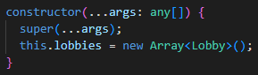

### My prior experience with JS

I wouldn’t by any means say I’m an expert at using JavaScript. I wouldn't even call myself 'experienced'. In fact, I only started learning it at the end of last October. However, in terms of the number of hours used, it is probably my most used language, even passing Java, which I used exclusively during my freshman year of college.

When I first started learning it, I was surprised by how similar it felt to using Java, syntactically, albeit without typing, which is a significant difference. After using it for a few weeks, I really enjoyed coding in JavaScript. I find it more fun than Java, and I like the language's features (first-order functions, etc.). There are a few things that I still do out of habit, such as typing starting a for loop with int:

```java
for (int i = 0; ...) {
  ...
}
```

instead of

```js
for (let i = 0; ...) {
  ...
}
```

or trying to add typing to a function (usually in the arguments):

```java
int sum(int num1, int num2) {
  ...
}
```

instead of

```js
function sum(num1, num2) {
  ...
}
```

though usually I'd write

```js
const sum = (num1, num2) => {...}
```

### What I learned on freeCodeCamp and what to learn in the future

While doing the tutorial on freeCodeCamp, one thing I learned about was object bracket notation. Previously, I’d only used dot notation, but I see how bracket notation can be extremely valuable. With dot notation, you can’t use a variable for the property, but with bracket notation you can, while also doing the same thing that dot notation already does. I’m also not good at using the many array methods. The ones at the top of my list to learn are `.filter`, `.map`, and `.reduce`.

### ES6

I also have some experience with ES6, but I still have a lot to learn. The features I use most commonly are let and const, destructuring, modules, and arrow functions.

Using let and const to declare variables is much safer than using var all the time. I prefer using ES6 imports compared to require because it is async, plus I think the syntax is easier to read.

At first, I thought arrow functions were a really weird way to write functions, but I grew used to them and now prefer how they look over normal functions. I think using them allows for more succinct code, and they are especially helpful when writing anonymous functions for callbacks or event handlers.

One thing that’s not in ES6 but I also use a lot is `async`/`await`. I find it way easier to read than chaining `.then`’s. It also replaces `.catch` with regular `try`/`catch` blocks, which is also easier to understand.

One feature of ES6 that I am not very familiar with is spread/rest syntax. I understand what it does and how it’s used, but I find it hard to recognize when it can be used while coding. I’ve only used it once or twice, specifically when I wanted to pass the same arguments from a custom class’ constructor to the `super()` call.



### TypeScript

Recently, I’ve started using TypeScript and I really like it. The language’s strong typing means better type safety and I can use IDE tools like IntelliSense. For example, when VSCode knows a variable is a string, it will offer string methods. It also helps a lot to check for errors in code before being shipped, like null checking. Since I only started learning it recently, I’m still not used to a lot of the syntax, like how to make union types or intersection types, or the features, like writing interfaces. However, when used well, I think it is a better language to use than JavaScript.
