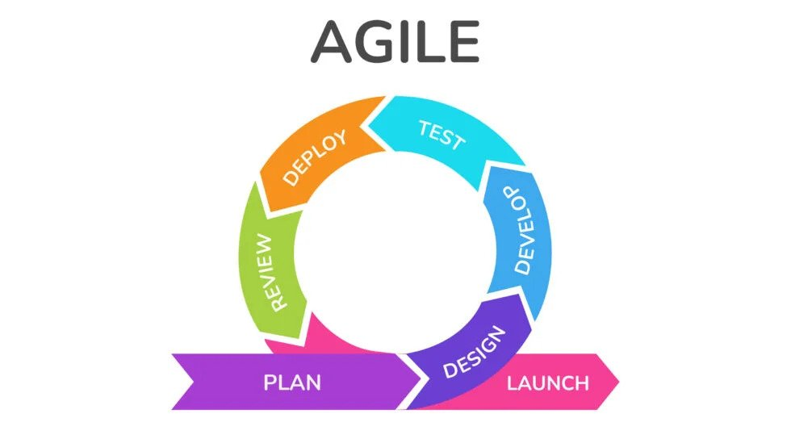

**If you are reading an essay about software engineering, I’m assuming you have an understanding of the basics.**

### Thoughts about "software engineering" 💭

I don’t think software engineering is a skill you can just pick up in a classroom. There isn’t a concrete definition; it’s more like a way of thinking you practice continuously as you learn to code. There are many concepts and principles that any budding software engineer should learn, like programming paradigms, following coding standards, using version control, etc.

### What I learned

Over the last 4 months, I learned the basics of many of these concepts and principles and incorporated them into my coding toolbox. The biggest thing I learned about was project management, specifically Agile project management. In case you don’t know, Agile is a methodology about continuously pushing small changes and fixes. It focuses on rapid development, constantly building upon previous work.

As a previously solo-only developer, I’d never worked on a team project before (Well, that’s not entirely true. I worked on a team project for a robotics team, but that was before I was remotely experienced in coding) so I never had to worry about project management. I’m really glad I got to practice working in a team, especially while still in a class setting because I’d imagine it is way less stressful than being in a team on a job. The hardest part about it, which no one could’ve predicted, is having teammates.

I now fully understand the point of coding standards, writing documentation, and project management. When working with other people, if they don’t format their code like they are supposed to, it is really hard to read it. Also, writing documentation is very important to tell other developers what they need to know when using your function, class, component, etc. I tried to make the documentation I wrote as clear as possible, obviously putting a description, arguments, and return values, but also example/recommended usage and possible pitfalls. Lastly, with Agile development, each issue is small and isolated, so many developers can work on different things at the same time.

### The future

Of course, my journey becoming a software engineer doesn't stop here. Like I said, I'll keep practicing and incrementally get better. To be a software engineer, I think it is important to always have a goal or interest in coding. It keeps you motivated to keep learning and honing your skills. For me, although I want to focus on web development (if that even stays as a job), I recently am interested in learning [Rust](https://www.rust-lang.org/), so I started reading through "[the book](https://doc.rust-lang.org/book/)". I'm excited to learn about low level programming and how it is different from what I'm used to.

I'm also excited to start an internship this summer. To become a better programmer, I'm going to try absorb as much knowledge from my peers/mentors as I can. Hopefully, I can use this opportunity to expand my network for more opportunities in the future! Also, since I'm going to be part of a team, I want to see the difference between a professional team and a makeshift school team.
