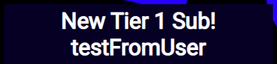

This widget was my first project and my introduction to web development. It is just a box made with raw HTML and CSS, with a scrolling background image that responds to various Twitch events. The scrolling background is like Atrioc's webcam background, and the integrated alerts that pop out are like Northernlion's.

### > Day 1: 10/15/22

The goal of this project was very simple: I wanted a box that did something when a Twitch event happened. Originally, I planned to use Stream Elements' dev. toolkit to make the widget, but after messing around with it for a day, I decided it would be 1) easier to make it from scratch, and 2) more beneficial to learn from the ground up. Well, after day one, I felt like I was throwing myself in the fire, even though I knew the project was simple in concept. To put things in perspective, before making this, I had only worked with HTML and CSS (and _very_ little JS). I was practically following tutorials for every step of the way. I didn't really know what the difference between a server and client is, I'd never even heard of "REST", I didn't know what a webhook or CLI was, basically I was a complete newbie.

### > Week 1:

By this point, I made the simple box with scrolling background, and a function to make a little pop up appear with text. I set up an Express server to serve the static files, and set up Socket.io to send real-time messages from client to server. I read a little more of the Twitch docs and played around with their CLI, trying to get something to show up in the console.

During this week, and actually most of them, I spent most of my time reading through the docs and tutorials for the Twitch API. Specifically, I adapted the code from this [Simple Node.js example](https://dev.twitch.tv/docs/eventsub/handling-webhook-events/#simple-nodejs-example).

### > Week 2:

In week 2, I had a better understanding of how OAuth protocol worked, but I still had trouble getting my event handler to receive mock events from the CLI. Eventually, I was able to get some of those events listeners working for real events (but still not from the CLI). After doing a lot more reading, I found myself looking at using Nginx for a reverse-proxy to localhost, but instead chose to just have it hosted somewhere. I picked the hosting service, [Render](https://render.com/), semi-arbitrarily, but mainly because I read they have a good free tier.

I thought I was done, or at least very close, but the deployment kept failing and having issues. Plus, since I still could not use the CLI to test my app, it was difficult to continue development. I was pretty sure my problems stemmed only from a lack of understanding, so I told myself I would come back to this project once I learned more.

### > 1/13/23:

Fast forward to January 13, a few months later, and I came back to get things in order. When I looked back at my code, I didn't realize how messy and hard to follow it was. I was using Express to serve All the JS was in one super-file (which wasn't the worst crime, because the project was pretty small). I split up the express server code from the Twitch constants and functions.

Repo: <a href="https://github.com/winstonco/alerts-border-widget"><i class="large github icon "></i>winstonco/alerts-border-widget</a>
