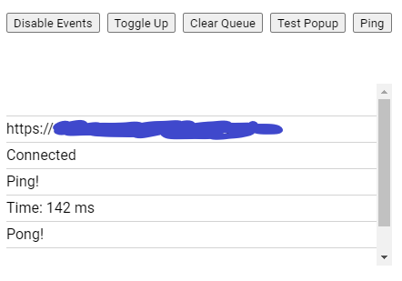

This widget was my first project and my introduction to web development. It is just a box made with raw HTML and CSS, with a scrolling background image that responds to various Twitch events. The scrolling background is like Atrioc's webcam background, and the integrated alerts that pop out are like Northernlion's.

---

### First learning web development

The goal of this project was very simple: I just wanted a box that did something when a Twitch event happened. _I mean, how hard can that be?_ Originally, I planned to use Stream Elements' developer toolkit to make the widget, but after messing around with it for a day, I decided against it because it would be 1) easier to make it from scratch, and 2) more beneficial to learn from the ground up. Well, after day one, I felt like I was throwing myself in the fire, even though I knew the project was simple in concept. To put things in perspective, before making this, I had only worked with HTML and CSS (and _very_ little JS). I was practically following tutorials for every step of the way. I didn't really know what the difference between a server and client is, I'd never even heard of "REST", I didn't know what a webhook or CLI was, basically I was a complete beginner.

### Week 1:

By this point, I made the simple box with scrolling background, and a function to make a little pop up appear with text. I set up an Express server to serve the static files, and set up Socket.io to send real-time messages from client to server. I read a little more of the Twitch docs and played around with their CLI, trying to get something to show up in the console.

During this week, and actually most of them, I spent most of my time reading through the docs and tutorials for the Twitch API. Specifically, I adapted the code from this [Simple Node.js example](https://dev.twitch.tv/docs/eventsub/handling-webhook-events/#simple-nodejs-example).

### Week 2:

In week 2, I had a better understanding of how OAuth protocol worked, but I still had trouble getting my event handler to receive mock events from the CLI. Eventually, I was able to get some of those events listeners working for real events (but still not from the CLI). After doing a lot more reading, I found myself looking at using Nginx for a reverse-proxy to localhost, but instead chose to just have it hosted somewhere. I picked the hosting service, [Render](https://render.com/), semi-arbitrarily, but mainly because I read they have a good free tier.

I thought I was done, or at least very close, but the deployment kept failing and having issues. Plus, since I still could not use the CLI to test my app, it was difficult to continue development. I was pretty sure my problems stemmed only from a lack of understanding, so I told myself I would come back to this project once I learned more.

### Finishing touches:

Fast forward to January 13, a few months later, and I came back to the project to get things in order. When I looked back at my code, I didn't realize how messy and hard to follow it was. I split up the express server code from the Twitch constants and functions. I also added a janky UI so I could control its functionality by interacting with it directly from OBS.

---

Repo: <a href="https://github.com/winstonco/alerts-border-widget"><svg xmlns="http://www.w3.org/2000/svg" width="20" height="20" fill="currentColor" class="bi bi-github mx-1" viewBox="0 0 16 16"><path d="M8 0C3.58 0 0 3.58 0 8c0 3.54 2.29 6.53 5.47 7.59.4.07.55-.17.55-.38 0-.19-.01-.82-.01-1.49-2.01.37-2.53-.49-2.69-.94-.09-.23-.48-.94-.82-1.13-.28-.15-.68-.52-.01-.53.63-.01 1.08.58 1.23.82.72 1.21 1.87.87 2.33.66.07-.52.28-.87.51-1.07-1.78-.2-3.64-.89-3.64-3.95 0-.87.31-1.59.82-2.15-.08-.2-.36-1.02.08-2.12 0 0 .67-.21 2.2.82.64-.18 1.32-.27 2-.27.68 0 1.36.09 2 .27 1.53-1.04 2.2-.82 2.2-.82.44 1.1.16 1.92.08 2.12.51.56.82 1.27.82 2.15 0 3.07-1.87 3.75-3.65 3.95.29.25.54.73.54 1.48 0 1.07-.01 1.93-.01 2.2 0 .21.15.46.55.38A8.012 8.012 0 0 0 16 8c0-4.42-3.58-8-8-8z"></path></svg> winstonco/alerts-border-widget </a>
