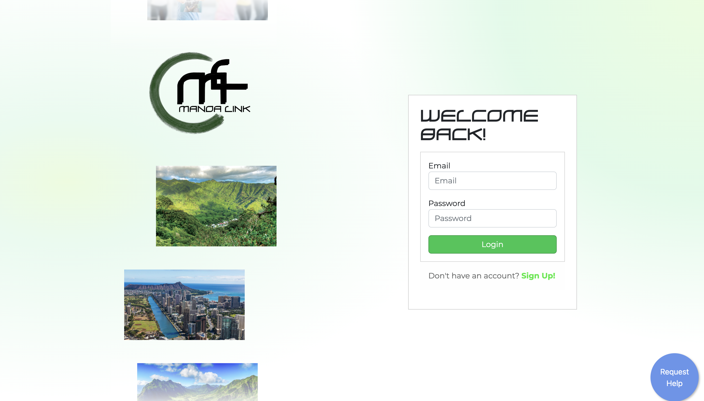
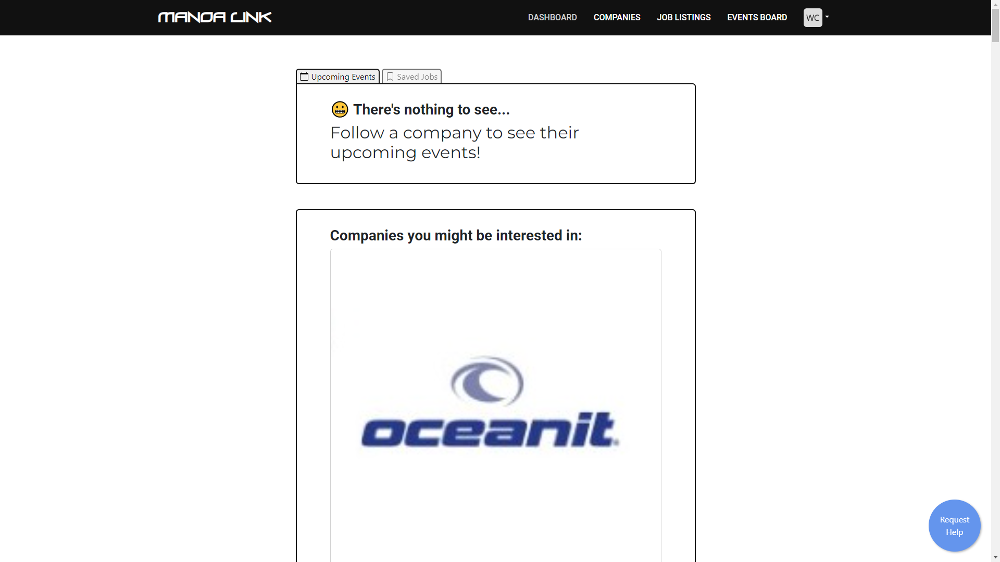
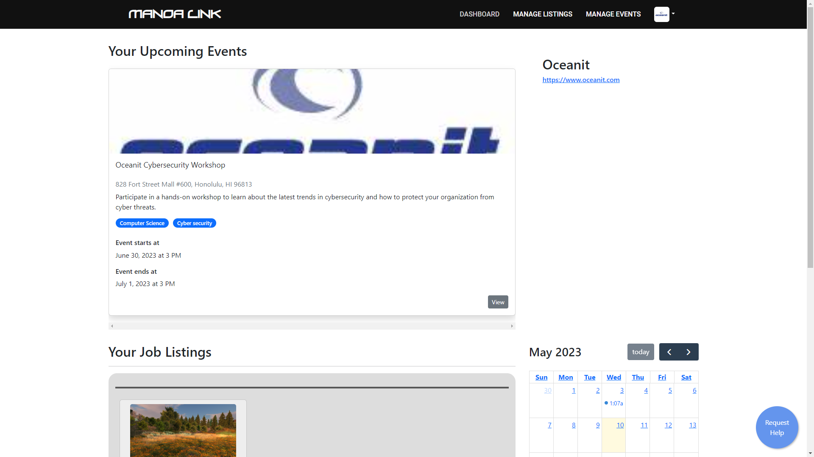
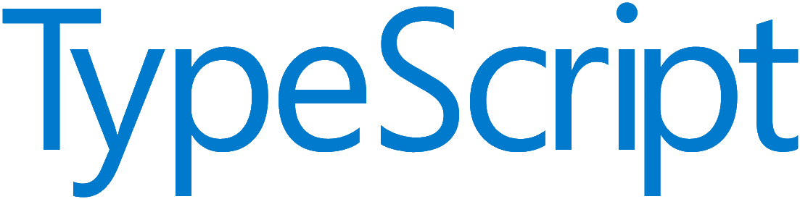

<figure>
  
  <figcaption>Landing Page</figcaption>
</figure>

### [Visit the app](https://manoalink.site)

### What is Manoa Link?

For my Software Engineering I final project, me and three other students: Jared Lo, Honggun Jeon, and Prayag Das, created an app to solve the problem that all computer science students face: finding jobs. We all know that it is important to get an internship. You learn a lot more in a professional environment than in a classroom, and you can network and make connections for opportunities after you graduate.

However, the hardest part is getting your name known. It might seem impossible to get your name out there, and with other platforms, it is hard to tell if companies are really looking, which is why we created Manoa Link.

_From our [project page](https://uhmanoalink.github.io/):_

Manoa Link is an innovative web platform designed to facilitate easy meetups between students, job seekers, and companies. It serves as a one-stop solution for students looking to connect with potential employers, explore job opportunities, and attend industry events. With dedicated interfaces for students and companies, ManoaLink streamlines the process of building relationships, fostering growth, and creating meaningful connections.

### Features

<figure>
  
  <figcaption>Student Dashboard</figcaption>
</figure>

For students, the home page mainly consists of a feed where they can see upcoming events and review their saved jobs. As a student follow companies, any events that the company posts will show up in their feed. Also, if the student has specific events saved through the Events Board, they will also show up. From the Upcoming Events page, they can add any events to Google or Outlook Calendar. The other tab shows Saved Jobs. Here they can see specific job listings that they have saved. The job listings show details about the job and link to the application.

<figure>
  
  <figcaption>Company Dashboard</figcaption>
</figure>

For companies, the dashboard was meant to give an overview of everything. Companies can see all their upcoming events and job listings posted. On each job, it also shows a badge with how many people saved their job, so they have some popularity metrics. Finally, there's a calendar widget populated with their upcoming events so they can easily see their availability.

---

In class, we learned about the Meteor framework, which lets developers easily build full-stack applications. Although now it's a bit old, Meteor's community is robust, so there are Atmosphere packages that solve most problems.

This was my first time using Meteor, and will probably be my last. I see how it can be appealing to some developers, but to me, in the process of simplifying it actually overcomplicated.

### Development

In my team, it seemed I was the only one with experience in software development, let alone web development. Naturally, I took on the roles of both project manager and lead developer. Just from how my schedule was, I had a lot more time to work on the project than my team members, so I got very familiar with the project and tried my best to help my team with their issues.

Though it slowed development, I made sure to enforce good practices by setting up CI to run ESLint checks and our tests. I tried to make sure our tests accurately tested each aspect of the project. I set up the GitHub repository so that pull requests required approval from at least one person, and whenever I reviewed someone's changes I made sure they were following good practices, updating documentation, and cleaning up other areas of conflict. I tried to keep the style consistent throughout the project as best I could.

Since the project was already a big undertaking and my teammates were new, I didn't want to overwhelm them with too many new things. First, I introduced them to [ (TypeScript)](https://www.typescriptlang.org/), but only for our test files, so that a) writing tests is easier and b) maybe they see why TypeScript is so great. I also introduced them to [ (Sass)](https://sass-lang.com/) to make our CSS modular, but they couldn't wrap their head around it just compiling to a regular CSS file. I don't think my teammates got any value out of either, but hopefully now they are at least a bit more familiar if they come across them in the future.

### My contribution

It's hard to pinpoint what I worked on since I generally contributed throughout the entire project. I'd like to think my biggest contribution is my influence on everyone's coding habits.

Whenever I worked on something new, if it was a new component, I tried to make it as reusable as possible, with complete documentation on what the component does, its props, and example usage. And speaking of components, I tried to have everyone start thinking 'component-wide' instead of 'page-wide' like they were used to. If I was making a new page, I started with a wireframe in Figma before actually coding, and I wrote tests for its functionality.

One area that my teammates _desperately_ needed help was debugging. In short, they were completely inexperienced in fixing their code. The first thing I noticed, which shocked me, was that my teammates would _never_ log anything to the console. They avoided it like how I avoid comments! They just didn't know that there even was a console! And since they had no idea about the console, when they first started debugging, they never opened the DevTools. Or when they did, they'd look at the big, red error message but never stop to read it! Granted, Meteor's error messages are not always helpful, but there's always something to find in them.

### Some final remarks

This project was the biggest, and only, team project I've really ever worked on. At some points, I felt out of place or uncomfortable, since I had no prior experience being a team lead. Admittedly, I often felt it might've been easier to work on this project solo, but is the point of doing a project to be easy?

I'm glad I got to work on Manoa Link with my team. Since working on a team project is something I'll definitely have to learn to do, I'm grateful that I could experience it (in a small scale) here. Throughout the weeks, I watched my teammates learn and become much better coders. I'm proud of them for pushing themselves, especially on the last week, and I'm honestly proud of myself for guiding them as best as I could.

---

App Repo: <a href="https://github.com/uhmanoalink/manoa-link"><svg xmlns="http://www.w3.org/2000/svg" width="1em" height="1em" fill="currentColor" class="bi bi-github mx-1" viewBox="0 0 16 16"><path d="M8 0C3.58 0 0 3.58 0 8c0 3.54 2.29 6.53 5.47 7.59.4.07.55-.17.55-.38 0-.19-.01-.82-.01-1.49-2.01.37-2.53-.49-2.69-.94-.09-.23-.48-.94-.82-1.13-.28-.15-.68-.52-.01-.53.63-.01 1.08.58 1.23.82.72 1.21 1.87.87 2.33.66.07-.52.28-.87.51-1.07-1.78-.2-3.64-.89-3.64-3.95 0-.87.31-1.59.82-2.15-.08-.2-.36-1.02.08-2.12 0 0 .67-.21 2.2.82.64-.18 1.32-.27 2-.27.68 0 1.36.09 2 .27 1.53-1.04 2.2-.82 2.2-.82.44 1.1.16 1.92.08 2.12.51.56.82 1.27.82 2.15 0 3.07-1.87 3.75-3.65 3.95.29.25.54.73.54 1.48 0 1.07-.01 1.93-.01 2.2 0 .21.15.46.55.38A8.012 8.012 0 0 0 16 8c0-4.42-3.58-8-8-8z"></path></svg> uhmanoalink/manoa-link </a>

Project Page Repo: <a href="https://github.com/uhmanoalink/uhmanoalink.github.io"><svg xmlns="http://www.w3.org/2000/svg" width="1em" height="1em" fill="currentColor" class="bi bi-github mx-1" viewBox="0 0 16 16"><path d="M8 0C3.58 0 0 3.58 0 8c0 3.54 2.29 6.53 5.47 7.59.4.07.55-.17.55-.38 0-.19-.01-.82-.01-1.49-2.01.37-2.53-.49-2.69-.94-.09-.23-.48-.94-.82-1.13-.28-.15-.68-.52-.01-.53.63-.01 1.08.58 1.23.82.72 1.21 1.87.87 2.33.66.07-.52.28-.87.51-1.07-1.78-.2-3.64-.89-3.64-3.95 0-.87.31-1.59.82-2.15-.08-.2-.36-1.02.08-2.12 0 0 .67-.21 2.2.82.64-.18 1.32-.27 2-.27.68 0 1.36.09 2 .27 1.53-1.04 2.2-.82 2.2-.82.44 1.1.16 1.92.08 2.12.51.56.82 1.27.82 2.15 0 3.07-1.87 3.75-3.65 3.95.29.25.54.73.54 1.48 0 1.07-.01 1.93-.01 2.2 0 .21.15.46.55.38A8.012 8.012 0 0 0 16 8c0-4.42-3.58-8-8-8z"></path></svg> uhmanoalink/uhmanoalink.github.io </a>
