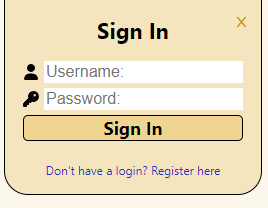
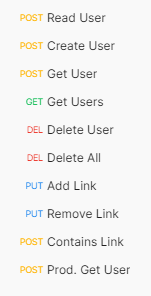

### <a href="https://search-helper-production.up.railway.app/" target="_blank" style='text-decoration:underline'>Search Helper</a>

### The goal 🏁

It's just a tool to search queries on either Google or site in the Stack Exchange network (default: Stack Overflow). There are a few operators you can add to a query to narrow search results, used similar to tags in a CLI:

```
--[text] : don't include
!-[text] : must include
t-[text] : must have tag
```



Users can also register with a username and password in order to save (⭐) search results.

### A dumb joke

I had the idea for the project mostly as a joke because my friend was complaining about how hard it was to find exactly what he wanted on Google and Stack Overflow (for homework answers), so I guess there's demand for a project like this.

### Learning React

It took a bit of getting used to the pattern of making components to represent things I would otherwise do in HTML, but after the initial learning curve, I found React very fun to use. To me, using component architecture is intuitive and practical and solves many problems that come up using just vanilla JavaScript and HTML.

### Using a database

The project uses a MongoDB instance, set up within the project on Railway. This is the first (and only time) I've used a database. I didn't (and still don't) even know SQL, but am currently learning it.

After hours of reading the docs and tutorials and watching videos, I vaguely understood how documents, which are basically just JSON, are organized in collections, which is managed by the project on an admin user, which are all in datasets, which can be a single database or a cluster for horizontal scaling 😵.

#### Backend



Postman API testing

The server I set up for this project is simple, and really just to retrieve data from the database. Here's when I learned what a REST API was and different API request types (GET, POST, DELETE, etc.).

### A confession...

However, I have a confession to make about this project. It's kinda hard to explain, but there's another (kinda anonymous) contributer to the project, who helped guide me in learning React and other development patterns. He introduced me to the term "monorepo", which doing on accident, and used the [Lerna](https://lerna.js.org/) monorepo tool to manage the front and backend.

He also introduced me to Docker and wrote the Dockerfile. He taught me how Docker works and what it's used for.

Finally, he helped me deploy my code on Railway. Since Railway automatically detects a Docker file, the deployment process went smoothly. My first attempt to deploy something was with my Widget, but I had many problems doing so. My first attempts at deploying this project were also relatively unsuccessful, maybe because I didn't know what building a project vs starting it was.

---

Repo: <a href="https://github.com/winstonco/search-helper"><svg xmlns="http://www.w3.org/2000/svg" width="20" height="20" fill="currentColor" class="bi bi-github mx-1" viewBox="0 0 16 16"><path d="M8 0C3.58 0 0 3.58 0 8c0 3.54 2.29 6.53 5.47 7.59.4.07.55-.17.55-.38 0-.19-.01-.82-.01-1.49-2.01.37-2.53-.49-2.69-.94-.09-.23-.48-.94-.82-1.13-.28-.15-.68-.52-.01-.53.63-.01 1.08.58 1.23.82.72 1.21 1.87.87 2.33.66.07-.52.28-.87.51-1.07-1.78-.2-3.64-.89-3.64-3.95 0-.87.31-1.59.82-2.15-.08-.2-.36-1.02.08-2.12 0 0 .67-.21 2.2.82.64-.18 1.32-.27 2-.27.68 0 1.36.09 2 .27 1.53-1.04 2.2-.82 2.2-.82.44 1.1.16 1.92.08 2.12.51.56.82 1.27.82 2.15 0 3.07-1.87 3.75-3.65 3.95.29.25.54.73.54 1.48 0 1.07-.01 1.93-.01 2.2 0 .21.15.46.55.38A8.012 8.012 0 0 0 16 8c0-4.42-3.58-8-8-8z"></path></svg> winstonco/search-helper </a>
