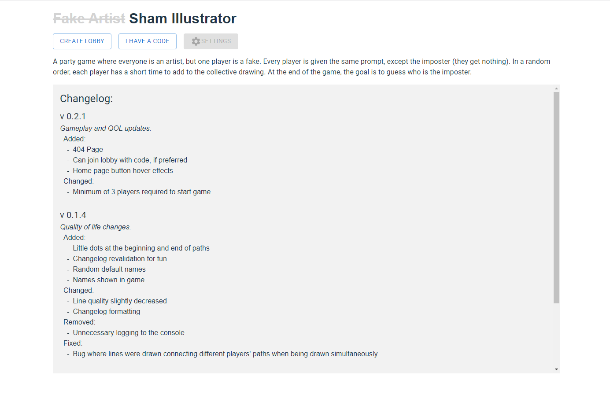
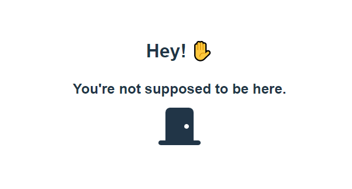

  
  Home page
  <h3><a href="https://sham-illustrator.onrender.com/" target="_blank" style='text-decoration:underline'>Play Now</a></h3>

### About the game

#### What is Sham Illustrator?

It's a party game where everyone is an artist, but one player is actually a fake. Every player is given the same prompt, except the imposter (they get nothing). In a random order, each player has a short time to add to a collective drawing, each trying to prove they know what the true prompt is. At the end of the game, the goal is to guess who the imposter was.

#### Game setup

You can create a lobby by clicking the link above, and clicking `CREATE LOBBY`.

**[Note]** for some reason, the initial page load time is _really_ slow. It might have to do with how the changelog is being fetched, so I need to look into it.

After creating a lobby and entering a name or continuing with the randomly generated one, click `COPY INVITE LINK` to get a link to share with other people. Alternatively, other players can join your lobby with the 12-character code, if that's easier for some reason.

#### How to play

Once a minimum of three players have joined a lobby. Press `START` to start the game. One player will have the role 'Imposter' and everyone else will be 'Real'. Everyone except the Imposter should see the prompt appear and who is currently drawing. That player has default 10 seconds to draw something on the screen. Players rotate until every player has gone, after which every player may guess a name who they think was faking it.

At least, that's what's supposed to happen...

#### One final note

Well, the thing is, it isn't actually done yet. Actually, there's quite a bit to do. At the top of the list is getting the end of game stuff working. Currently, players can guess by typing a name, but the responses are not handled, so nothing happens. Also, in the final version, players will guess by just clicking an icon or name. Also x2, game settings (the diabled button on the home page) is also at the top of the list. When it's done, players can customize their lobbies however they like!

---

### The goal 🏁

Initially, I thought the project would be on the shorter side, but a little over a month later, I no longer think it is. The goal was mainly to learn TypeScript, which I enjoy using very much, and at the same time get more familiar with React. I also wanted to try Material UI, a React component library, to learn more about different development tools and styles.

Overall, I'm really proud of this project. All of it is my own work, and development has been pretty smooth. I have a lot of fun working on it and am very excited for when it's finally done and I can play it with my friends 🙂.

#### Vite

I believe it was also the first time I used the build tool [Vite](https://vitejs.dev/), which I also really love using. Before, I'd used CRA (Create React App), which _feels_ slower than Vite, but I don't know the details of why.

This blog post by Chetan Gawai: ["4 Reasons Why You Should Prefer Vite Over Create-React-App (CRA)"](https://semaphoreci.com/blog/vite#:~:text=Unlike%20a%20CRA%20or%20bundler,large%20component%20libraries%20like%20mui) goes in more detail about the advantages of using Vite.

### this.start()

Being my first time using TypeScript in a project, the first week was pretty light. I was mostly playing around with TypeScript to first make a proof of concept. I made a canvas and some methods to draw with the mouse. Then, I made an Express server and used Socker.io to send draw events to other players. Once I got the fundamentals of the game created, I knew it was feasible.

### New? Obvious? project structure

This time, I have client and server code in _separate repositories_ (revolutionary, I know), unlike in my [Search Helper](/314-techfolio/projects/search-helper.html). Since I have to open 2 instances of VSCode, one for client-side and one for server-side, in a way it's inconvenient having them separate. It's definitely made up for during deployment since I don't have to rebuild my server-side code when I push new client-side code, for example. I also think it is also more organized than a monorepo style.

### Testing 😓

Recently, I decided to add tests to this project, mainly E2E tests with Cypress, but I haven't gotten around to it yet. I realize it would save me a lot of time instead of manually testing every page and feature.

---

  
  Custom 404 page. The door goes back to home.

---

Repo: <a href="https://github.com/winstonco/sham-illustrator"><svg xmlns="http://www.w3.org/2000/svg" width="20" height="20" fill="currentColor" class="bi bi-github mx-1" viewBox="0 0 16 16"><path d="M8 0C3.58 0 0 3.58 0 8c0 3.54 2.29 6.53 5.47 7.59.4.07.55-.17.55-.38 0-.19-.01-.82-.01-1.49-2.01.37-2.53-.49-2.69-.94-.09-.23-.48-.94-.82-1.13-.28-.15-.68-.52-.01-.53.63-.01 1.08.58 1.23.82.72 1.21 1.87.87 2.33.66.07-.52.28-.87.51-1.07-1.78-.2-3.64-.89-3.64-3.95 0-.87.31-1.59.82-2.15-.08-.2-.36-1.02.08-2.12 0 0 .67-.21 2.2.82.64-.18 1.32-.27 2-.27.68 0 1.36.09 2 .27 1.53-1.04 2.2-.82 2.2-.82.44 1.1.16 1.92.08 2.12.51.56.82 1.27.82 2.15 0 3.07-1.87 3.75-3.65 3.95.29.25.54.73.54 1.48 0 1.07-.01 1.93-.01 2.2 0 .21.15.46.55.38A8.012 8.012 0 0 0 16 8c0-4.42-3.58-8-8-8z"></path></svg> winstonco/sham-illustrator </a>
